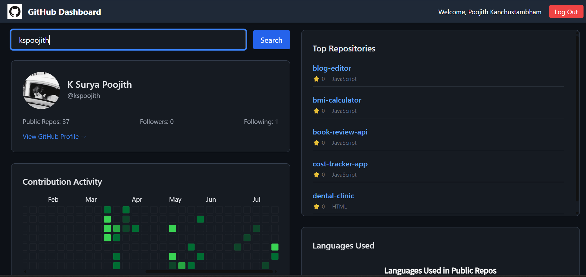

# ⚡ GitHub User Dashboard

A sleek and interactive dashboard that visualizes any GitHub user's public profile — built using **React**, **GitHub API**, and **FusionCharts**. Enter a GitHub username and explore their top repositories, contribution calendar, and key stats in real-time.

🔗 [Live Demo on Vercel](https://your-vercel-link.vercel.app)  
📦 Tech Stack: React.js, Axios, Chart.js, FusionCharts, GitHub API

---

## ✨ Features

- 🔍 **Real-Time User Search** — Enter any GitHub username and fetch live data.
- 📊 **Top Repositories** — Lists top public repos sorted by stars and forks.
- 📆 **Contribution Calendar** — Visualizes daily contributions using FusionCharts.
- 🚫 **Error Handling** — Handles 404 errors and invalid usernames gracefully.
- 🎨 **Clean UI** — Minimalistic responsive layout with customized scrollbars.

---

## 📸 Demo Preview

  
_Real-time GitHub data visualized with clean UI_

---

## 🚀 Getting Started

### 1. Clone the Repo

```bash
git clone https://github.com/your-username/github-user-dashboard.git
cd github-user-dashboard
```

### 2. Install Dependencies

```bash
npm install
```

### 3. Start the Dev Server

```bash
npm run dev
```

> ⚠️ No API key required — uses GitHub’s free public API (rate-limited).

---

## 🧠 What I Learned

- Integrating third-party APIs (GitHub)
- Parsing and visualizing real-time user data
- Debugging API calls and improving user experience
- Handling edge cases like missing usernames, broken responses
- Building charts and contribution maps

---

## 🛠️ Tools Used

| Tool           | Purpose                    |
|----------------|----------------------------|
| React.js       | Frontend Framework         |
| Axios          | API Requests               |
| FusionCharts   | Contribution Calendar      |
| Chart.js       | Data Visualization         |
| GitHub API     | Public user data           |
| Vercel         | Deployment Platform        |

---

## 💡 Possible Improvements

- GitHub OAuth login to show authenticated user data
- Theme toggle (light/dark mode)
- Export profile as PDF
- Search history and caching

---

## 📬 Feedback & Suggestions

Feel free to fork, star ⭐, and raise issues or suggestions.  
Reach out to me on [LinkedIn](https://linkedin.com/in/your-profile) or via [email](mailto:you@example.com).

---

## 📄 License

MIT License
